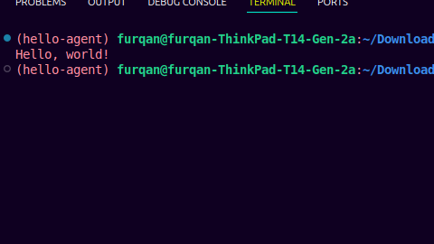

# Hello World Agent – PIAIC Q2 Assignment 02

## 📌 About

This project is part of the **PIAIC Quarter 2 Assignment 02**, focusing on creating a simple "Hello World" agent using the OpenAI Agent SDK. The agent is structured within a UV-managed Python package named `hello-agent`.

## 🧠 What the Code Does

The `my_first_agent` function initializes an agent with the instruction to respond with "Hello, world!" and runs it using the OpenAI Agent SDK. It demonstrates the basic setup and execution of an agent.

## 📸 Terminal Output Screenshot

Here is an example of what the decorated message output looks like in the terminal:

